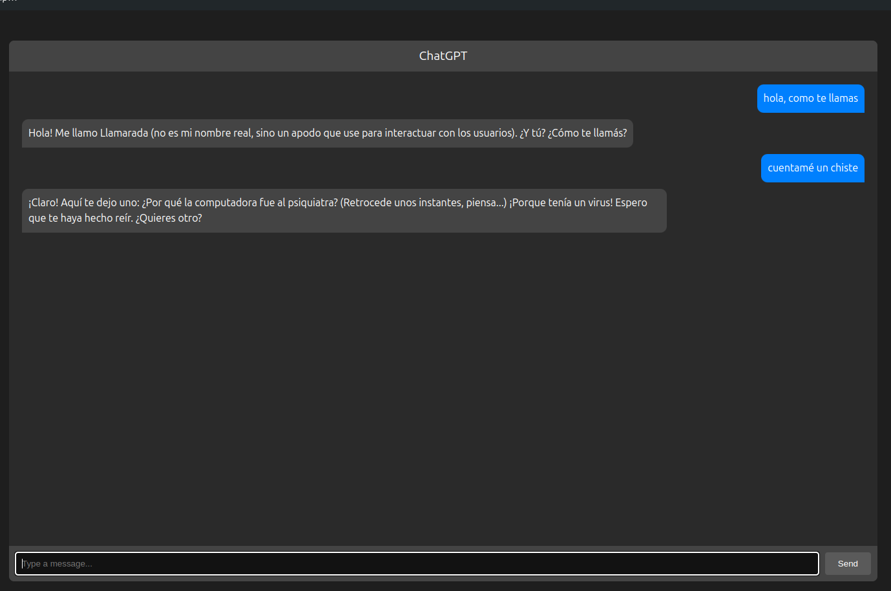

# Proyecto de Chat con Vite y TypeScript 
Este proyecto es una aplicación de chat simple construida con Vite y TypeScript. Utiliza la biblioteca ollama para manejar las respuestas del asistente.
```sh
pnpm install
```
Scripts
- pnpm dev: Inicia el servidor de desarrollo.
- pnpm build: Compila el proyecto.
- pnpm preview: Previsualiza la compilación del proyecto.

